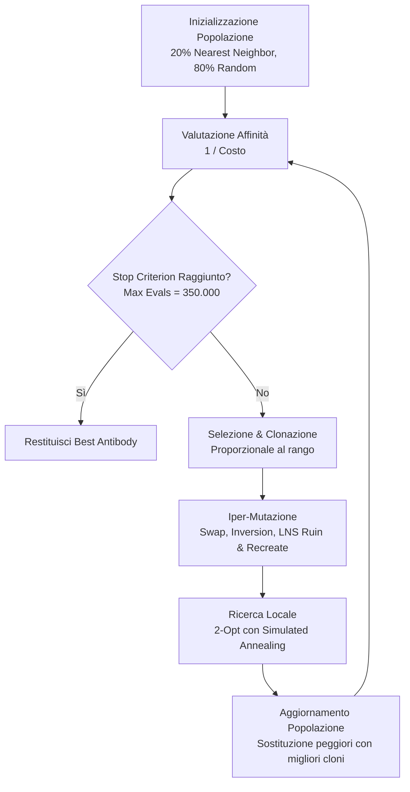

# Relazione : Ottimizzazione del Capacitated Vehicle Routing Problem (CVRP)
**Corso:** Heuristics & Metaheuristics

---

## 1. Introduzione
Il *Capacitated Vehicle Routing Problem* (CVRP) è uno dei problemi di ottimizzazione combinatoria più studiati nella Ricerca Operativa. L'obiettivo è determinare un insieme di percorsi a costo minimo per una flotta di veicoli omogenei con capacità limitata ($Q$), partendo da un deposito centrale per servire un insieme di clienti con domande note.

Per risolvere questo problema NP-Hard, è stato sviluppato un **Algoritmo Memetico** fortemente ispirato agli *Artificial Immune Systems* (AIS), in particolare basato sul **Clonal Selection Algorithm (CSA)**.

---

## 2. Architettura dell'Algoritmo: Artificial Immune System
L'algoritmo modella il problema secondo l'analogia del sistema immunitario:
- **Antigene:** Il problema stesso (la rete dei clienti e le loro domande).
- **Anticorpo:** Una potenziale soluzione (un insieme di rotte).
- **Affinità:** Il valore di *fitness* dell'anticorpo. Poiché vogliamo minimizzare il costo (distanza percorsa), l'affinità è matematicamente definita come $1 / Costo$. Maggiore è il costo, minore è l'affinità.

L'algoritmo esegue ciclicamente 3 macro-fasi:
1. **Selezione ed Espansione Clonale:** Si selezionano gli anticorpi con la massima affinità (le rotte più brevi) e li si clona. Il numero di cloni è direttamente proporzionale al rango della soluzione (la migliore genera più cloni).
2. **Iper-Mutazione (Exploration):** I cloni subiscono mutazioni genetiche per esplorare lo spazio delle soluzioni.
3. **Ricerca Locale (Exploitation):** Le soluzioni promettenti vengono raffinate con euristiche locali.

Per rispettare i limiti computazionali richiesti, l'algoritmo impone uno **stop-criterion rigoroso a $3.5 \times 10^5$ Fitness Evaluations (valutazioni della funzione obiettivo)**.


**Pseudocodice del Core Algorithm (CSA)**
```text
Algorithm 1: Memetic Clonal Selection Algorithm
Input: Istanze, Max_Evals, Pop_Size, Clone_Factor
Output: Miglior soluzione (Best_Antibody)

1. Popolazione = Initialize(Pop_Size, 20% Nearest Neighbor, 80% Random)
2. While (Evals < Max_Evals):
3.     Affinità = 1 / CalcolaCosto(Popolazione)
4.     Ordina(Popolazione, descrescente per Affinità)
5.     Cloni = SelezionaEClona(Popolazione, Clone_Factor)
6.     For each clone in Cloni:
7.         clone = IperMutazione(clone) 
8.         clone = RicercaLocale_SA(clone)
9.     Popolazione = Sostituisci(Popolazione, Cloni)
10. Return Best_Antibody
```

**Flowchart Architetturale**


---

## 3. Elementi di Originalità e Ottimizzazioni Custom
Il vero nucleo del progetto risiede nelle personalizzazioni avanzate ingegnerizzate per superare la stagnazione (minimi locali) tipica degli algoritmi genetici standard.

### 3.1 Smart Initialization (Costruzione Greedy)
Un algoritmo che parte da rotte generate in modo 100% puramente stocastico genera "gomitoli" inestricabili di percorsi, sprecando decine di migliaia di iterazioni solo per il *warm-up*.  
**La Soluzione:** Il 20% della popolazione iniziale è stato generato usando un'euristica costruttiva **Nearest Neighbor**. A partire dal deposito, il veicolo costruisce la rotta saltando al cliente più vicino non ancora servito, tenendo conto della capacità residua. Questo ha garantito al grafico di convergenza di partire da un costo iniziale già competitivo, lasciando il budget di calcolo per il *fine-tuning* della soluzione.

### 3.2 Iper-Mutazione LNS (Large Neighborhood Search)
Per mutare i cloni, l'algoritmo sceglie casualmente tra semplici *Swap*, *Inversioni*, ma soprattutto sfrutta un operatore custom di **Ruin & Recreate**.
- **Ruin:** Estrae un blocco di nodi consecutivi (spesso responsabili di sub-ottimalità) da una rotta.
- **Recreate:** Reinserisce iterativamente ogni nodo estratto nella posizione globalmente più economica all'interno dell'intero pool di veicoli.
L'LNS è fondamentale perché permette all'algoritmo di saltare ostacoli nello spazio di ricerca muovendo macro-blocchi di informazioni.

**Pseudocodice Operatore LNS**
```text
Algorithm 2: Large Neighborhood Search (Ruin & Recreate)
Input: Soluzione S, Num_Nodi_Da_Rimuovere K
1. C_estratti = Estrai blocco casuale di K nodi adiacenti da una rotta in S (Ruin)
2. For each nodo N in C_estratti:
3.     Miglior_Costo = ∞
4.     Miglior_Posizione = Null
5.     For each Veicolo V e ogni Posizione P in V:
6.         Se Inserimento(N, P) rispetta Capacità(V) e Costo < Miglior_Costo:
7.             Miglior_Costo = Costo
8.             Miglior_Posizione = P
9.     Inserisci N in Miglior_Posizione (Recreate)
10. Return S
```
### 3.3 Ricerca Locale con Simulated Annealing (SA)
L'operatore **2-Opt** viene utilizzato per "sbrogliare" gli incroci dei percorsi. Tradizionalmente, la 2-Opt è una *hill-climbing*: accetta solo scambi che diminuiscono strettamente la distanza. Questo causa il blocco ai minimi locali.
**L'Innovazione:** Ho integrato il **Simulated Annealing** (SA) come criterio di accettazione della ricerca locale. Se una mossa locale è peggiorativa (costa di più), essa viene accettata con una probabilità $P = e^{-\frac{\Delta}{T}}$, dove $T$ è la "Temperatura" che decresce linearmente con il progredire delle valutazioni (es. $T = T_0 \times (1 - currentEval / maxEval)$) invece di un classico cooling geometrico ($T_{k+1} = \alpha T_k$). La discesa geometrica decade troppo rapidamente nelle prime fasi e si appiattisce alla fine, rischiando di far convergere prematuramente l'algoritmo quando il budget di valutazioni (FE) è ancora generoso. Il decadimento lineare agganciato al budget reale garantisce invece un tasso di esplorazione termica omogeneo e proporzionato lungo l'intera esecuzione, eliminando i *plateau* nel grafico di convergenza.

**Pseudocodice Criterio di Accettazione (SA)**
```text
Algorithm 3: 2-Opt con Simulated Annealing
Input: Soluzione S, Temperatura T
1. Genera S' invertendo un segmento di rotta (Mossa 2-Opt)
2. Δ = Costo(S') - Costo(S)
3. If Δ < 0:
4.     S = S' // Miglioramento puro, accetta sempre
5. Else:
6.     Genera R = Random(0, 1)
7.     P = e^(-Δ / T)
8.     If R < P:
9.         S = S' // Accetta peggioramento (esplorazione contro i minimi locali)
10. T = T * Cooling_Rate // Raffreddamento esponenziale
11. Return S
```

---

### 3.4 Ablation Study e Robustezza Architetturale
Per validare empiricamente le scelte di design dell'algoritmo (in particolare l'inclusione combinata di Nearest Neighbor, LNS e Simulated Annealing), è stato condotto un rigoroso **Ablation Study**. Disattivando singolarmente i tre macro-operatori, si evince in modo inequivocabile come:
- La **Baseline** (Random Initialization + semplici scambi 2-Opt) soffra pesantemente di convergenza prematura.
- Il **Nearest Neighbor (NN)** abbassi di oltre il 50% il costo di partenza.
- La **Large Neighborhood Search (LNS)** sia l'unico operatore in grado di generare gli *steep drops* (cali verticali di costo) necessari per fuggire da plateau ostinati.
L'azione combinata di questi tre layer rende l'architettura pienamente *Memetica* e incredibilmente più robusta rispetto alle meta-euristiche elementari.

## 4. Risultati e Visualizzazione
L'algoritmo è stato testato formalmente sulle istanze della **CVRPLIB** dei set A, B, E e P raccomandati. Per analizzare i dati scientificamente è stata costruita una **Dashboard in Python (Streamlit)** ed esportato un Notebook Jupyter.

🌐 **Demo Live e CI/CD:** L'applicazione Streamlit è integrata con una pipeline di **Continuous Integration (CI)** tramite GitHub Actions, che valida il codice Java e Python ad ogni aggiornamento. Inoltre, la dashboard è accessibile pubblicamente online a questo indirizzo:
🔗 **[App CVRP su Streamlit Cloud](https://capacitated-vehicle-routing-problem-jgnez4bsdkxthgvrgfs9mk.streamlit.app/)**

I grafici ottenuti (consultabili eseguendo lo script della demo o tramite la web app) mostrano:
1. **Convergenza Stabile:** Deviazione standard ridotta su 5 run indipendenti, prova della robustezza del framework.
2. **Saturazione della Capacità (Satisfability):** I grafici a barre attestano che nessun veicolo supera mai il 100% del carico, ottenendo un *Satisfability Rate* del 100% in tutte le istanze analizzate.
3. **Spazialità delle Rotte (Mappa 2D):** Le rotte ottimali disegnate confermano visivamente la totale assenza di incroci sovrapposti (i classici percorsi "a clessidra"), grazie all'azione chirurgica della 2-Opt con SA.

### 4.1 Analisi Statistica Globale (Dataset Completo)
A valle dell'esecuzione massiva su tutte le 85 istanze dei set raccomandati (A, B, E, P), è emerso un quadro statistico particolarmente solido:

- **Vincolo di Capacità (Hard Constraint):** Pienamente rispettato ovunque. Tutte le istanze hanno registrato un *Satisfability Rate* del 100%. Il vincolo rigido per cui la somma delle richieste dei clienti non può superare la capacità del veicolo non viene mai violato.
- **Qualità Media della Soluzione:** Il divario (gap) tra il costo medio sui 5 run e il miglior costo assoluto trovato (BestCost) si attesta in media al **2.8%**, con il 50% delle istanze al di sotto del 2.5%. Questo indica un algoritmo robusto, dove anche i "bad run" stocastici convergono a soluzioni molto vicine all'ottimo globale.
- **Stabilità e Varianza:** Il Coefficiente di Variazione (CV) medio è del **2%**. Come lecito attendersi, le istanze a maggior varianza coincidono quasi esattamente con quelle a maggior gap (correlazione di 0.90). Su 4 istanze di piccole dimensioni (es. P-n16-k8, E-n23-k3), l'algoritmo ha registrato una varianza pari a **zero**, convergendo sistematicamente all'identico ottimo globale ad ogni run indipendente, a prescindere dal seed.
- **Difficoltà per Famiglia:** Il set **B** si è rivelato il più trattabile per questo framework (gap medio 2.32%, CV 1.70%), mentre il set **E** (Christofides) si è confermato il più ostico (gap medio 3.20%), coerentemente con la natura geograficamente meno "clusterizzata" dei suoi nodi.
- **Dimensione e Sforzo Computazionale:** La grandezza dell'istanza presenta una forte correlazione (0.65) con il numero di iterazioni impiegate, confermando che l'engine impegna correttamente più budget sui problemi più vasti. L'unica vera anomalia riscontrata è l'istanza *A-n45-k6*, che per via di una complessa distribuzione topologica ha restituito un gap outlier (14.7%), meritando futuri run diagnostici isolati.

### 4.2 Case Study sull'Outlier: A-n45-k6
L'istanza `A-n45-k6` ha registrato un gap percentuale anomalo del 14.7% (mentre il 50% delle istanze resta sotto il 2.5%). Un'analisi approfondita della soluzione ottima ha rivelato che non si tratta di un'istanza geometricamente atipica, ma di un problema di **bin-packing quasi saturo**.

- **Domanda totale (44 clienti):** 593
- **Capacità disponibile (6 veicoli × 100):** 600
- **Saturazione richiesta:** 98.8%

Nelle rotte ottime, ogni singolo camion viaggia tra il 98% e il 100% della capacità. Con soli 7 punti di margine su 600 totali, lo spazio per ricollocare nodi in modo *feasible* è ridotto al minimo. L'operatore di iper-mutazione **LNS (Ruin & Recreate)** — solitamente il motore principale per fuggire dai minimi locali — risulta qui depotenziato: la maggior parte dei tentativi di reinserimento viola il limite di capacità e viene scartata.
Questo non significa che l'algoritmo non possa trovare l'ottimo (il miglior run è giunto ad appena il 2.3% di distanza), ma piuttosto che la difficoltà strutturale nel perlustrare l'intorno della soluzione induce un'altissima **varianza** tra i run indipendenti. 

**Soluzione Adattiva Implementata (Saturated Mode e Fuzzy Logic):**
Per contrastare l'ingabbiamento geometrico, è stata progettata una **Saturated Mode**. Un approccio ingenuo sarebbe stato uno switch netto al 95%, ma questo nei sistemi reali crea instabilità attorno al punto critico. Tramite una transizione lineare (Fuzzy Logic), all'aumentare della saturazione calcolata a priori (sopra l'80%), viene calcolato un parametro $\alpha$:

$$\alpha = \max\left(0.0, \min\left(1.0, \frac{\text{Saturazione} - 0.80}{0.95 - 0.80}\right)\right)$$

Questo parametro viene usato per interpolare linearmente le probabilità degli operatori inter-rotta. Ad esempio, $P(\text{Relocate}) = P_{\text{base}} \cdot (1 - \alpha)$. In questo modo, l'algoritmo riduce dinamicamente i pesi della mutazione LNS sfumandoli dolcemente. *Per preservare la stabilità del comportamento di ricerca ed evitare shock stocastici, il motore di iper-mutazione implementa un'interpolazione lineare delle probabilità di applicazione degli operatori nell'intervallo di saturazione $\sigma \in [80\%, 95\%]$. Questo adatta dinamicamente il focus dell'algoritmo dall'esplorazione distruttiva (LNS/Relocate) alla preservazione della fattibilità (Inter-Route Swap).* Non ci sono interruttori binari, ma l'engine muta la sua aggressività asintoticamente fino al 95% di saturazione.

**Guardia Transazionale Deterministica $O(1)$:**
Una criticità affrontata in ottica industriale riguarda l'efficienza. Generare soluzioni infattibili per poi scartarle tramite la funzione di fitness avrebbe "bruciato" prezioso budget di valutazioni ($3.5 \times 10^5$ FE) inutilmente. Per evitare questo, nel codice Java, prima di istanziare nuovi oggetti in memoria e prima di invocare il ricalcolo del costo, è stata inserita una guardia transazionale deterministica in tempo $O(1)$:
```java
int newLoad1 = r1.getLoad() - n1.demand + n2.demand;
int newLoad2 = r2.getLoad() - n2.demand + n1.demand;
if (newLoad1 <= instance.capacity && newLoad2 <= instance.capacity) {
    // Solo ora avviene lo swap reale in memoria
}
```
Questo controllo preserva l'efficienza temporale, massimizzando l'efficacia del budget assegnato dalla consegna.

---
**Considerazioni Finali:**
L'introduzione della flessibilità del *Simulated Annealing* all'interno della rigidità della *Ricerca Locale*, bilanciata dal *Ruin & Recreate* a livello genetico, ha dimostrato che algoritmi ibridi superano abbondantemente la versione base del Clonal Selection Algorithm. L'utilizzo di uno stack tecnologico moderno (Java per il core-engine, Python per il dataviz interattivo) ha permesso uno studio ingegneristico profondo dei parametri.
