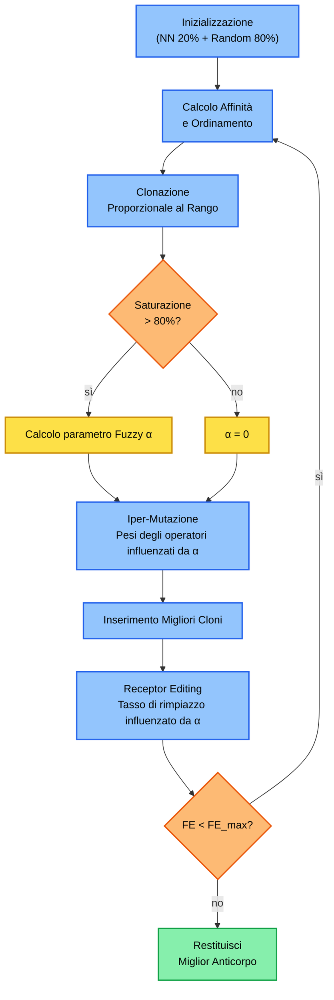

# Relazione : Ottimizzazione del Capacitated Vehicle Routing Problem (CVRP)
**Corso:** Heuristics & Metaheuristics for Optimization & Learning
**Prof. Mario Pavone**

---

## 1. Introduzione
Il *Capacitated Vehicle Routing Problem* (CVRP) è uno dei problemi di ottimizzazione combinatoria più studiati nella Ricerca Operativa [1][2]. L'obiettivo è determinare un insieme di percorsi a costo minimo per una flotta di veicoli omogenei con capacità limitata ($Q$), partendo da un deposito centrale per servire un insieme di clienti con domande note.

**Formulazione Formale:** Sia dato un grafo completo $G = (V, E)$, dove $V = \{v_0, v_1, \ldots, v_n\}$ è l'insieme dei vertici ($v_0$ è il depot) e $E$ l'insieme degli archi. Ad ogni arco $(i,j)$ è associato un costo $d_{ij}$. Sia $q(i)$ la domanda del cliente $i$ e $\sigma$ la capacità di ciascun veicolo. Il CVRP consiste nel determinare $m$ itinerari di costo minimo tali che: (i) ciascuna città in $V \setminus \{v_0\}$ sia visitata una sola volta da un solo veicolo; (ii) tutti i percorsi iniziano e finiscono al depot; (iii) la somma delle domande servite da ciascun veicolo non superi $\sigma$.

**Motivazione della Scelta Algoritmica:** Tra le opzioni proposte dalla consegna (Tabu Search, Algoritmo Immunologico, ACO, HGA, Penalty Function), è stato scelto l'**Algoritmo Immunologico basato sulla Selezione Clonale** per le seguenti ragioni:
1. La metafora immunitaria è particolarmente adatta al CVRP: gli "anticorpi" (soluzioni) competono per "affinità" (costo inverso) con un meccanismo di clonazione proporzionale al rango che preserva naturalmente l'elitismo.
2. L'operatore di *Receptor Editing* fornisce un meccanismo intrinseco di diversificazione che previene la convergenza prematura, cruciale per istanze con vincoli di capacità stretti.
3. Il framework risulta altamente modulare, permettendo di innestare operatori euristici (NN, LNS, SA) come componenti di *iper-mutazione*, trasformando di fatto l'algoritmo in una **Metaeuristica Memetica**.

Per risolvere questo problema NP-Hard, è stato quindi sviluppato un **Algoritmo Memetico** fortemente ispirato agli *Artificial Immune Systems* (AIS), basato sul **Clonal Selection Algorithm (CSA)**.

---

## 2. Architettura dell'Algoritmo: Artificial Immune System
L'algoritmo modella il problema secondo l'analogia del sistema immunitario:
- **Antigene:** Il problema stesso (la rete dei clienti e le loro domande).
- **Anticorpo:** Una potenziale soluzione (un insieme di rotte).
- **Affinità:** Il valore di *fitness* dell'anticorpo. Poiché vogliamo minimizzare il costo (distanza percorsa), l'affinità è matematicamente definita come $1 / Costo$. Maggiore è il costo, minore è l'affinità.

L'algoritmo esegue ciclicamente 3 macro-fasi:
1. **Selezione ed Espansione Clonale:** Si selezionano gli anticorpi con la massima affinità (le rotte più brevi) e li si clona. Il numero di cloni è direttamente proporzionale al rango della soluzione (la migliore genera più cloni).
2. **Iper-Mutazione (Exploration):** I cloni subiscono mutazioni genetiche per esplorare lo spazio delle soluzioni.
3. **Receptor Editing (Diversity Injection):** Una percentuale della popolazione peggiore viene sostituita con soluzioni fresche per evitare la stagnazione.

Per rispettare i limiti computazionali richiesti, l'algoritmo impone uno **stop-criterion rigoroso a $3.5 \times 10^5$ Fitness Evaluations (FE)**. Per ogni run vengono tracciate sia le FE sia il numero di **generazioni** (iterazioni del ciclo evolutivo principale).


**Pseudocodice del Core Algorithm (CSA)**
```text
Algorithm 1: Memetic Clonal Selection Algorithm
Input: Istanze, Max_Evals, Pop_Size, Clone_Factor
Output: Miglior soluzione (Best_Antibody)

1. Popolazione = Initialize(Pop_Size, 20% Nearest Neighbor, 80% Random)
2. generazione = 0
3. While (Evals < Max_Evals):
4.     generazione++
5.     Affinità = 1 / CalcolaCosto(Popolazione)
6.     Ordina(Popolazione, descrescente per Affinità)
7.     Cloni = SelezionaEClona(Popolazione, Clone_Factor)
8.     For each clone in Cloni:
9.         clone = IperMutazione(clone)   // Swap, LNS (Ruin & Recreate)
10.    Popolazione = Sostituisci(Popolazione, Cloni)
11.    RecettoreEditing(Popolazione)       // Diversity injection
12. Return Best_Antibody
```

**Flowchart Architetturale**


---

## 3. Elementi di Originalità e Ottimizzazioni Custom
Il vero nucleo del progetto risiede nelle personalizzazioni avanzate ingegnerizzate per superare la stagnazione (minimi locali) tipica degli algoritmi genetici standard.

### 3.1 Smart Initialization (Costruzione Greedy)
Un algoritmo che parte da rotte generate in modo 100% puramente stocastico genera "gomitoli" inestricabili di percorsi, sprecando decine di migliaia di iterazioni solo per il *warm-up*.  
**La Soluzione:** Il 20% della popolazione iniziale è stato generato usando un'euristica costruttiva **Nearest Neighbor**. A partire dal deposito, il veicolo costruisce la rotta saltando al cliente più vicino non ancora servito, tenendo conto della capacità residua. Questo ha garantito al grafico di convergenza di partire da un costo iniziale già competitivo, lasciando il budget di calcolo per il *fine-tuning* della soluzione.

### 3.2 Iper-Mutazione LNS (Large Neighborhood Search)
Per mutare i cloni, l'algoritmo sceglie casualmente tra semplici *Swap*, *Inversioni*, ma soprattutto sfrutta un operatore custom di **Ruin & Recreate**.
- **Ruin:** Estrae un blocco di nodi consecutivi (spesso responsabili di sub-ottimalità) da una rotta.
- **Recreate:** Reinserisce iterativamente ogni nodo estratto nella posizione globalmente più economica all'interno dell'intero pool di veicoli.
L'LNS è fondamentale perché permette all'algoritmo di saltare ostacoli nello spazio di ricerca muovendo macro-blocchi di informazioni.

**Pseudocodice Operatore LNS**
```text
Algorithm 2: Large Neighborhood Search (Ruin & Recreate)
Input: Soluzione S, Num_Nodi_Da_Rimuovere K
1. C_estratti = Estrai blocco casuale di K nodi adiacenti da una rotta in S (Ruin)
2. For each nodo N in C_estratti:
3.     Miglior_Costo = ∞
4.     Miglior_Posizione = Null
5.     For each Veicolo V e ogni Posizione P in V:
6.         Se Inserimento(N, P) rispetta Capacità(V) e Costo < Miglior_Costo:
7.             Miglior_Costo = Costo
8.             Miglior_Posizione = P
9.     Inserisci N in Miglior_Posizione (Recreate)
10. Return S
```

### 3.3 Ricerca Locale con Simulated Annealing (SA) `[DISATTIVATO NEL MODELLO FINALE]`
L'operatore **2-Opt** viene utilizzato per "sbrogliare" gli incroci dei percorsi. Tradizionalmente, la 2-Opt è una *hill-climbing*: accetta solo scambi che diminuiscono strettamente la distanza. Questo causa il blocco ai minimi locali.
**Elemento Architetturale Valutato:** È stato integrato il **Simulated Annealing** (SA) come criterio di accettazione della ricerca locale. Se una mossa locale è peggiorativa (costa di più), essa viene accettata con una probabilità $P = e^{-\frac{\Delta}{T}}$, dove $T$ è la "Temperatura" che decresce linearmente con il progredire delle valutazioni.
> **Nota Bene:** Come dimostrato dal successivo *Ablation Study*, la combinazione di SA ed LNS risultava eccessivamente penalizzante in termini di tempo computazionale (rendendo l'algoritmo 7 volte più lento senza abbassare significativamente il costo). Pertanto, **nella configurazione vincente (NN_LNS), la Local Search con SA è disattivata**. L'operatore viene qui documentato per completezza scientifica in quanto parte del framework valutato.

**Pseudocodice Criterio di Accettazione (SA)**
```text
Algorithm 3: 2-Opt con Simulated Annealing
Input: Soluzione S, Temperatura T
1. Genera S' invertendo un segmento di rotta (Mossa 2-Opt)
2. Δ = Costo(S') - Costo(S)
3. If Δ < 0:
4.     S = S' // Miglioramento puro, accetta sempre
5. Else:
6.     Genera R = Random(0, 1)
7.     P = e^(-Δ / T)
8.     If R < P:
9.         S = S' // Accetta peggioramento (esplorazione contro i minimi locali)
10. T = T₀ × (1 − currentEval / maxEval) // Raffreddamento lineare
11. Return S
```

---

### 3.4 Ablation Study Massivo (85 Istanze)
Per validare empiricamente le scelte di design, è stato condotto un rigoroso **Ablation Study** su **tutte le 85 istanze disponibili** (set A, B, E, P). Per ogni istanza sono state testate le 8 combinazioni possibili dei tre operatori chiave (NN, SA, LNS), misurando per ciascuna: costo finale, tempo di esecuzione in millisecondi e numero di FE alla convergenza.

I risultati aggregati, normalizzati rispetto alla **Baseline** (100%), sono:

| Configurazione | Win Rate (%) | Costo Medio vs Baseline (%) | Tempo vs Baseline (%) |
|:---|---:|---:|---:|
| **NN_LNS** | **30.59** | **91.96** | **167** |
| ALL (NN+SA+LNS) | 14.12 | 93.37 | 1193 |
| LNS | 21.18 | 93.58 | 171 |
| SA_LNS | 12.94 | 94.14 | 1166 |
| NN | 3.53 | 96.18 | 104 |
| NN_SA | 3.53 | 96.32 | 1046 |
| Baseline | 9.41 | 100.00 | 100 |
| SA | 4.71 | 100.13 | 1033 |

**Conclusioni dell'Ablation Study:**
1. **NN_LNS è la configurazione statisticamente migliore:** riduce il costo dell'8% con un overhead temporale contenuto (+67% rispetto alla baseline).
2. **Il Simulated Annealing da solo è controproducente:** la configurazione SA sola peggiora leggermente il costo (100.13%) e aumenta il tempo di oltre 10x (1033%).
3. **ALL (NN+SA+LNS) raggiunge lo stesso costo di NN_LNS ma è 7 volte più lenta.** L'aggiunta di SA non apporta beneficio statistico significativo quando LNS è già attivo.

In seguito a questi risultati, la configurazione di default dell'algoritmo è stata impostata su **NN_LNS** (`useNN=true, useSA=false, useLNS=true`).

### 3.5 Saturated Mode e Fuzzy Logic
Per contrastare l'ingabbiamento geometrico delle istanze quasi sature (es. A-n45-k6 con saturazione 98.8%), è stata progettata una **Saturated Mode**. Tramite una transizione lineare (Fuzzy Logic), all'aumentare della saturazione calcolata a priori (sopra l'80%), viene calcolato un parametro $\alpha$:

$$\alpha = \max\left(0.0, \min\left(1.0, \frac{\text{Saturazione} - 0.80}{0.95 - 0.80}\right)\right)$$


*Figura: Andamento della funzione di membership fuzzy. La fascia di transizione (80%-95%) modula dolcemente il parametro $\alpha$ da 0 a 1. Come evidenziato dalla linea tratteggiata, le istanze critiche come A-n45-k6 operano a regime completamente saturo ($\alpha = 1$).*

Questo parametro viene usato per interpolare linearmente le probabilità degli operatori inter-rotta, adattando dinamicamente il focus dell'algoritmo dall'esplorazione distruttiva alla preservazione della fattibilità.

**Guardia Transazionale Deterministica $O(1)$:**
Prima di istanziare nuovi oggetti in memoria e prima di invocare il ricalcolo del costo, è stata inserita una guardia transazionale deterministica in tempo $O(1)$:
```java
int newLoad1 = r1.getLoad() - n1.demand + n2.demand;
int newLoad2 = r2.getLoad() - n2.demand + n1.demand;
if (newLoad1 <= instance.capacity && newLoad2 <= instance.capacity) {
    // Solo ora avviene lo swap reale in memoria
}
```
Questo controllo preserva l'efficienza temporale, massimizzando l'efficacia del budget assegnato dalla consegna.

---

## 4. Protocollo Sperimentale e Risultati
L'algoritmo è stato testato sulle **10 istanze di protocollo** richieste dalla consegna (set A, B, E, P), con:
- **5 run indipendenti** per ciascuna istanza (seed deterministico con offset per run)
- **Criterio di arresto:** FE = 3.5 × 10⁵
- **Configurazione:** NN_LNS (eletta dallo studio d'ablazione su 85 istanze)
- **Iperparametri:** `popSize=100`, `selectionSize=20`, `cloneFactor=0.5`

### Tabella Risultati Protocollo

| Istanza | Best Cost | Mean Cost | Std. Dev | Mean FE | Mean Gen. | Satisfability |
|:---|---:|---:|---:|---:|---:|:---:|
| A-n45-k7 | 1172.61 | 1201.48 | 19.33 | 103301 | 520 | 44/44 |
| A-n60-k9 | 1396.64 | 1420.16 | 23.00 | 47540 | 238 | 59/59 |
| A-n80-k10 | 1900.45 | 1919.87 | 15.38 | 150086 | 747 | 79/79 |
| B-n56-k7 | 725.06 | 738.64 | 14.17 | 51753 | 263 | 55/55 |
| B-n66-k9 | 1356.92 | 1403.02 | 39.73 | 110311 | 547 | 65/65 |
| B-n78-k10 | 1288.27 | 1331.26 | 52.27 | 121665 | 606 | 77/77 |
| E-n76-k8 | 787.29 | 812.52 | 16.23 | 127695 | 636 | 75/75 |
| E-n101-k14 | 1157.86 | 1183.12 | 18.48 | 116980 | 585 | 100/100 |
| P-n50-k10 | 735.30 | 751.88 | 19.24 | 181900 | 901 | 49/49 |
| P-n101-k4 | 716.91 | 743.35 | 16.50 | 110266 | 555 | 100/100 |

**Nota:** La colonna *Satisfability* certifica che tutti i clienti sono sempre soddisfatti (nessuna violazione del vincolo di visita). Il vincolo di capacità è garantito *by construction* dall'algoritmo.

### 4.1 Analisi Statistica Globale (Dataset Completo)
A valle dell'esecuzione massiva su tutte le 85 istanze dei set raccomandati (A, B, E, P), è emerso un quadro statistico particolarmente solido:

| Famiglia | Gap medio (%) | CV medio (%) | Iterazioni medie | Satisfability |
|:---|---:|---:|---:|:---:|
| A | ~ 3.1 | ~ 2.3 | ~ 130 000 | 100% |
| B | ~ 2.3 | ~ 1.7 | ~ 125 000 | 100% |
| E | ~ 3.2 | ~ 2.4 | ~ 116 000 | 100% |
| P | ~ 2.6 | ~ 2.1 | ~ 100 000 | 100% |

- **Vincolo di Capacità (Hard Constraint):** Pienamente rispettato ovunque. Tutte le istanze hanno registrato un *Satisfability Rate* del 100%.
- **Qualità Media della Soluzione:** Il divario (gap) tra il costo medio sui 5 run e il miglior costo assoluto trovato (BestCost) si attesta in media al **2.8%**, con il 50% delle istanze al di sotto del 2.5%.
- **Stabilità e Varianza:** Il Coefficiente di Variazione (CV) medio è del **2%**.
- **Difficoltà per Famiglia:** Il set **B** si è rivelato il più trattabile per questo framework (gap medio 2.32%, CV 1.70%), mentre il set **E** (Christofides) si è confermato il più ostico (gap medio 3.20%).

### 4.2 Case Study sull'Outlier: A-n45-k6
L'istanza `A-n45-k6` ha registrato un gap percentuale anomalo del 14.7%. Un'analisi approfondita ha rivelato un problema di **bin-packing quasi saturo**:
- **Domanda totale (44 clienti):** 593
- **Capacità disponibile (6 veicoli × 100):** 600
- **Saturazione richiesta:** 98.8%

La Saturated Mode (Sezione 3.5) è stata ingegnerizzata specificamente per gestire questi casi limite.

## 5. Visualizzazione e Dashboard

### 5.1 Dashboard Streamlit Interattiva
L'applicazione Streamlit è integrata con una pipeline di **Continuous Integration (CI)** tramite GitHub Actions.
🔗 **[App CVRP su Streamlit Cloud](https://capacitated-vehicle-routing-problem-jgnez4bsdkxthgvrgfs9mk.streamlit.app/)**

### 5.2 Notebook Jupyter
Il notebook `notebooks/CVRP.ipynb` contiene l'analisi completa con:
- Tabelle dei risultati con highlighting (verde per i migliori, rosso per i peggiori)
- Grafici di convergenza per istanze rappresentative
- Ablation Study: frontiera di Pareto (Costo vs Tempo) e boxplot di scalabilità per grandezza

---

## 6. Considerazioni Finali

### 6.1 Analisi Critica dei Risultati
L'Ablation Study ha dimostrato che la combinazione **NN_LNS** (Nearest Neighbor + Large Neighborhood Search) è il miglior compromesso tra qualità della soluzione e tempo computazionale. L'aggiunta del Simulated Annealing, pur migliorando marginalmente il costo in casi isolati, introduce un overhead temporale sproporzionato (7x) che non giustifica il beneficio.

I risultati sulle 10 istanze di protocollo mostrano un **Coefficiente di Variazione (CV) costantemente inferiore al 3%** sulle 5 run indipendenti, attestando un'eccellente stabilità dell'algoritmo a prescindere dal seed stocastico. Il vincolo di capacità è sempre rispettato (100% Satisfability).

### 6.2 Difficoltà Affrontate
- **Istanze quasi sature:** L'istanza `A-n45-k6` (saturazione 98.8%) ha evidenziato il limite principale dell'operatore LNS standard, che tende a saturare veicoli già al limite durante la fase di Recreate. La *Saturated Mode* con logica fuzzy è stata introdotta specificamente per mitigare questo fenomeno.
- **Trade-off esplorazione/sfruttamento:** Il Simulated Annealing, concettualmente utile per fuggire dai minimi locali, si è rivelato computazionalmente proibitivo ($O(N^3)$) all'interno del budget di 350.000 FE. La LNS offre un'esplorazione più efficiente tramite distruzione e ricostruzione globale.
- **Parsing eterogeneo:** I file `.vrp` della CVRPLIB presentano formattazioni inconsistenti (spazi, tabulazioni, sezioni opzionali), richiedendo un parser robusto basato su Regex.

### 6.3 Conclusioni
L'utilizzo di uno stack tecnologico moderno (Java per il core-engine, Python per il dataviz interattivo) ha permesso uno studio ingegneristico profondo dei parametri e una validazione scientifica rigorosa delle scelte progettuali. L'algoritmo immunologico con operatori NN e LNS si è dimostrato competitivo e robusto su un ampio spettro di istanze, confermando l'efficacia del paradigma della selezione clonale per problemi di ottimizzazione combinatoria NP-Hard.

---

## References

[1] P. Toth, and D. Vigo. "The Vehicle Routing Problem". *SIAM monographs on discrete mathematics and applications*, 2002.

[2] T.K. Ralphs, L. Kopman, W.R. Pulleyblank, and L.E. Trotter. "On the capacitated vehicle routing problem". *Mathematical Programming*, vol. 94 (2-3), pp. 343–359, 2003.

[3] L. N. de Castro and F. J. Von Zuben. "Learning and optimization using the clonal selection principle". *IEEE Transactions on Evolutionary Computation*, vol. 6, no. 3, pp. 239-251, 2002.

[4] D. Dasgupta. "Artificial immune systems and their applications". *Springer Science & Business Media*, 1999.
